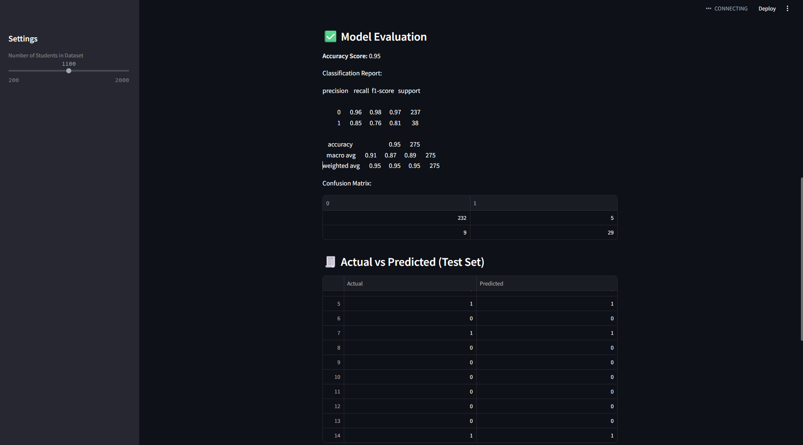

# 📊 Machine Learning Visualization App

This project is a **Streamlit-based web application** that visualizes the output of machine learning classification models using interactive charts. It's built using Python and several powerful data science libraries like Plotly, Scikit-learn, Pandas, and more.


## 🚀 Features

- Visualizes Confusion Matrix, ROC Curve, and more
- Clean and interactive UI using **Streamlit**
- Preloaded dataset for demo (no file upload required)
- Uses classification algorithms from **Scikit-learn**
- Great for demoing ML model performance visually


## 🖼️ Screenshots

| Confusion Matrix | ROC Curve | Precision-Recall |
|------------------|-----------|------------------|
|   |  |  


## 🛠️ Tech Stack

- **Frontend/UI**: Streamlit
- **ML Models**: Scikit-learn
- **Visualization**: Plotly, Matplotlib, Seaborn
- **Data Handling**: Pandas, NumPy


```bash
git clone https://github.com/Utkarsh-puranik/streamlit-ml-app.git
cd streamlit-ml-app
pip install -r requirements.txt
